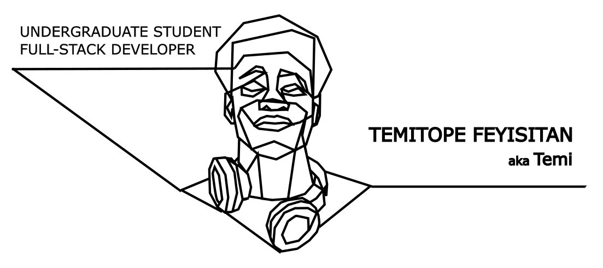

##  Howdy Stranger 👋 

Nice to meet you, I'm Temitope Feyisitan

### &nbsp;

## About Me 👽

- Final Year UG Computer Science student studying at the University of Birmingham, UK
- Nigerian living in the UK 
- Areas of interests include Front-end development and UX. Also looking to delve into the application of these in Game Development and AR and VR technologies
- I love art and design and would love to be involved in any of such projects

### &nbsp;

## Currently Learning 📚

_University of Birmingham_
- Computer Vision and Imaging
- Human Computer Interaction
- Advanced Functional Programming
- Mobile & Ubiquitous Computing
- Programming Language Principles, Design, and Implementation

_Personal_
- Unity
- C++
### &nbsp;

## Currently Working on 💻 

- Building a personal resume website
- World domination and such 🌍
- I’m currently looking for new opportunities 🔭

### &nbsp;

## Tech Stack ⚡
Here's a few things I just happened to picked up

- 💻 Python | Java | SQL | C | C++
- 🐍 Django
- 🛢️ MySQL
- 🐈 Git | Github | Gitlab
- 🌐 HTML | CSS | JavaScript

### &nbsp;

## GitHub Stats 👀
 &nbsp;            |  &nbsp;
:-------------------------:|:-------------------------:
 |  

### &nbsp;

## Contact Me 📫

Feel free to drop me an e-mail or connect with me on LinkedIn on any cool new projects and opportunities or just to say hi 😁 ⤵. 

 &nbsp;   

### &nbsp;

###### p.s. try looking at the banner with dark mode  🥺👉👈 ( you could take a look at light mode too i guess, if you're already on the dark side). Idk, I just thought it was kind of cool. Bye ❤️.

